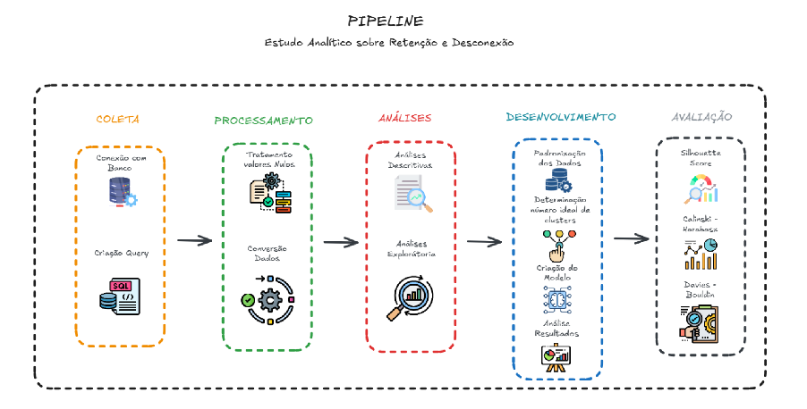

# Estudo Analítico sobre Comportamento Clientes em aspectos de Desconexão e Retenção

## Objetivo 🎯

O objetivo desta análise é compreender os padrões de comportamentos dos clientes que solicitaram desconexão. Desta forma, atráves dos resultados encontrados vamos buscar identificar fatores determinantes que influenciam a decisão de cancelamento, bem como oportunidades para melhorar a retenção de clientes. Certamente, o estudo visa fornecer insights valiosos que possam ser utilizados para desenvolver estratégias eficazes de retenção e melhorar a satisfação dos clientes.

## Tecnologias Utilizadas 🛠️

* **Linguagem:** Python e SQL
* **Bibliotecas:** Pandas, Numpy, Seaborn, Matplotlib, Sklearn, Pyodbc
* **Banco de Dados:** SQL Server

## Pipeline 📌

* Coleta de Dados: Nesta seção, é realizado a coleta dos dados necessários para a análise. Utilizaremos a biblioteca pyodbc para estabelecer uma conexão com o banco de dados SQL Server e executar uma consulta SQL que retorna informações detalhadas sobre os clientes que solicitaram a desconexão.

* Processamento: O processamento de dados é uma etapa crucial para garantir que os dados estejam no formato adequado para as análises e modelagens que vão ser futuramente realizadas.

* Análises: Realização de análises descritivas e exploratórias dos dados coletados e processados nas etapas anteriores. As análises descritivas e exploratórias são fundamentais para entender melhor os dados, identificar padrõres e gerar insights iniciais que podem orientar as próximas etapas do projeto.

* Modelagem e Aplicação de Técnicas de Machine Learning: Foco na aplicação do algoritmo de clusterização K-Means a partir dos dados previamente tratados e analisados. Além disso, são utilizadas métricas de avaliação de modelos de clusterização. Esta etapa visa segmentar os dados de forma significativa, contribuindo para uma melhor interpretação dos padrões encontrados.

## Principais Insights ✅

* Existem perfis de clientes mais sensíveis a problemas técnicos, enquanto outros são mais sensíveis a questões financeiras ou operacionais.

* Clientes com poucos meses de contrato possuem risco elevadode desconexão, especialmete quando há falhas na experiência inicial (onboarding).

* Clientes antigos podem desenvolver resistência à retenção, principalmente quando enfrentam problemas recorrentes ou não percebem evolução no serviço.

* A retenção tem impacto direto sobre o ciclo de vida dos clientes, mas deve ser acompanhada de melhorias no serviço, suporte e comunicação.

## Conclusão ✍🏽

Este projeto entregou uma análise profunda e orientada a dados, que proporciona uma visão estratégica dos clientes, seus comportamentos e seus riscos. Através de uma combinação de análises descritivas, modelagem preditiva e segmentação via clusterização, foi possível transformar dados operacionais em informação acionável, fortalecendo a capacidade da empresa em tomar decisões mais inteligentes, personalizar suas estratégias e, principalmente, melhorar a experiência do cliente e reduzir o churn.

O trabalho realizado não só entrega valor imediato, como também constrói uma base sólida para futuros avanços em análise preditiva, inteligência de dados e melhoria contínua dos processos de negócio.

